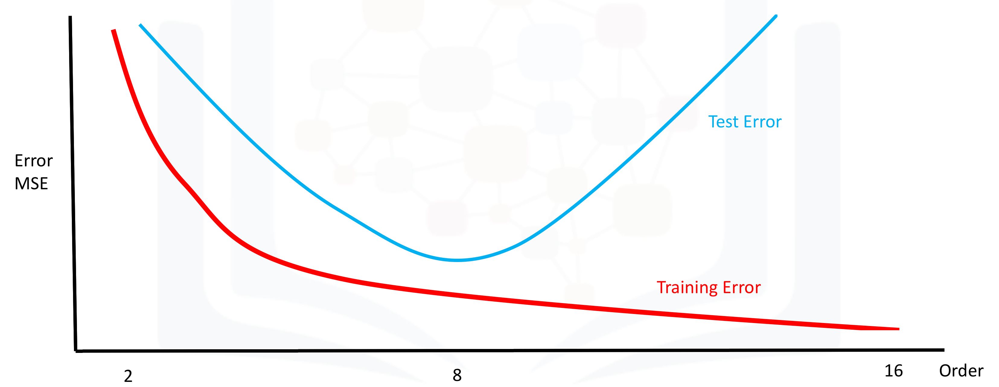

# Short quiz answers and explanations (polynomial order, train_test_split, cross_val_score, Ridge, GridSearch)

## 1) Best polynomial order from the plot

- Answer: **8**

Explanation:
- The plot shows training error (red) monotonically decreasing as model complexity (polynomial order) increases, while test error (blue) follows a U-shaped curve.
- The optimal model complexity is where the test error reaches its minimum (the lowest point of the blue curve). In the plot this occurs at order **8**, so the polynomial of order 8 provides the best generalization (best bias–variance trade-off).


## 2) Correct use of `train_test_split` to use 40% of data for testing, `random_state=0`, with features `x_data` and targets `y_data`
- Correct call:
  ```python
  from sklearn.model_selection import train_test_split

  X_train, X_test, y_train, y_test = train_test_split(
      x_data, y_data, test_size=0.4, random_state=0
  )
  ```

Explanation:
- `test_size=0.4` means 40% of samples go to the test set.
- `random_state=0` is a seed so the split is reproducible.
- The right return order is `(X_train, X_test, y_train, y_test)`.
- Common mistakes:
  - `test_size=0` is invalid for the desired split (it would produce an empty test set).
  - `random_state` should be an int (or None); `0.4` as `random_state` is incorrect.
  - `train_test_split(x_data, y_data)` uses default `test_size=0.25` and `random_state=None`, which is not the 40% / seed=0 configuration you requested.


## 3) What is the output of `cross_val_score(lre, x_data, y_data, cv=2)`?
- Precise behavior / answer:
  - `cross_val_score` returns an array of scores, one for each cross-validation fold. With `cv=2` you get an array with 2 scores.
  - For a linear regression estimator (`lre`), the default scoring is the estimator's `score` method, which for regressors is R². So you get the R² value computed on the test (validation) set for each of the two folds:
    ```python
    scores = cross_val_score(lre, x_data, y_data, cv=2)  # e.g. array([0.85, 0.82])
    ```
  - If you want the average (mean) R² across folds, compute:
    ```python
    import numpy as np
    mean_score = np.mean(scores)
    ```

Explanation:
- `cross_val_score` does not itself return a single average value by default — it returns the per-fold scores. You can compute average/std manually if needed.
- It also does not "find free parameter alpha" — that's what hyperparameter search (GridSearchCV, RandomizedSearchCV, or an estimator with built-in CV) would do.


## 4) How to create a Ridge regression object `RR` with alpha = 10
- Correct:
  ```python
  from sklearn.linear_model import Ridge

  RR = Ridge(alpha=10)
  ```

Explanation:
- `Ridge` is the regularized linear model that accepts the `alpha` parameter (regularization strength).
- `LinearRegression` does not accept `alpha` (it is the ordinary least squares estimator with no regularization), so `LinearRegression(alpha=10)` is invalid.


## 5) Param grid dictionary to search only alpha = 1, 10, 100
- Correct dictionary:
  ```python
  param_grid = [{'alpha': [1, 10, 100]}]
  ```

Example usage with `GridSearchCV`:
```python
from sklearn.model_selection import GridSearchCV
from sklearn.linear_model import Ridge

param_grid = [{'alpha': [1, 10, 100]}]
grid = GridSearchCV(Ridge(), param_grid, cv=5)
grid.fit(X_train, y_train)

# best parameter and best score
grid.best_params_, grid.best_score_
```

Explanation:
- `param_grid` can be either a dict or a list of dicts. Using `[{'alpha': [1, 10, 100]}]` ensures GridSearchCV will only test those three values for `alpha` and no other hyperparameters.
- The longer dictionary you showed (with many alphas and `'normalize':[True,False]`) would test many more combinations; it is not limited to the requested three alpha values.


## Short summary (quick reference)
- Best polynomial order from the plot: **8** (test error minimal).
- Correct train/test split: `train_test_split(x_data, y_data, test_size=0.4, random_state=0)` → returns `X_train, X_test, y_train, y_test`.
- `cross_val_score(..., cv=2)` returns an array of two R² scores (one per fold). Use `np.mean(...)` to get the average.
- Create ridge regressor with alpha=10: `RR = Ridge(alpha=10)`.
- Param grid to test only alpha ∈ {1,10,100}: `param_grid = [{'alpha': [1, 10, 100]}]`.

